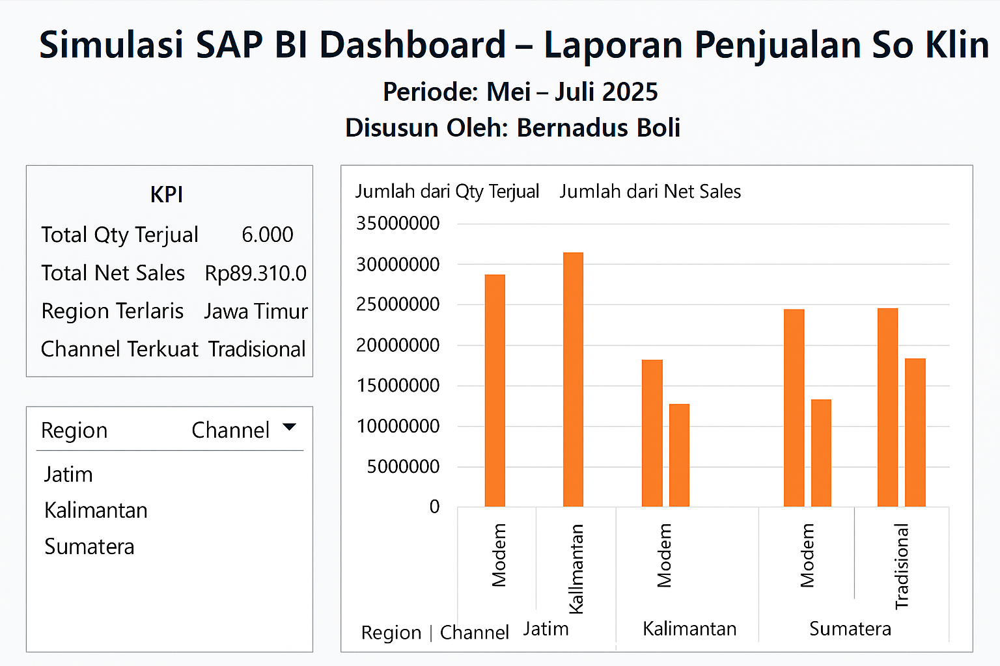
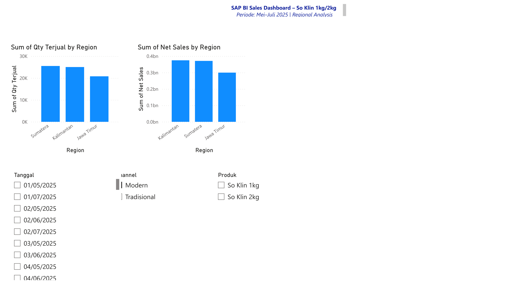

# SAP BI Sales Dashboard – So Klin 1kg/2kg

Simulasi proyek Business Intelligence (BI) menggunakan data penjualan So Klin 1kg & 2kg  
Periode: Mei–Juli 2025 | Analisis per Region, Channel, Produk

---

## 📊 Versi 1: Excel Pivot Dashboard

- Dibuat menggunakan PivotTable, Chart, dan Slicer
- Visualisasi KPI: Qty Terjual dan Net Sales
- Filtering interaktif berdasarkan tanggal, produk, dan channel

🖼️ Preview Excel:

📁 File Excel: `SoKlin_SAP_Dashboard.xlsx`

---

## ⚡ Versi 2: Power BI Dashboard

- Visualisasi interaktif menggunakan Power BI
- Slicer dan filter lebih fleksibel (date, region, channel, product)
- Lebih dinamis & scalable untuk data besar

🖼️ Preview Power BI:

📁 File Power BI: `SoKlin_SAPBI_PowerBI.pbix`

---

## 📂 Dataset
- `SoKlin_SalesData_1.csv`: Source data untuk kedua dashboard

---

## 🔧 Tools Used
- Excel (Pivot Table, Chart, Slicer)
- Power BI (Bar Chart, Slicer, Formatting)
- CSV Data Modeling

## 👤 Disusun oleh:
**Bernadus Boli**  
SAP BI | Data Analyst | Excel Dashboard Enthusiast
