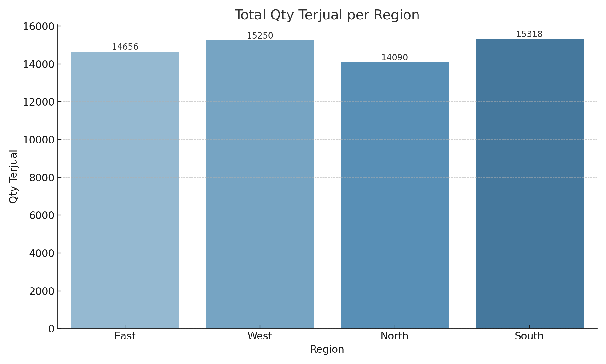

# 📊 SAP BI Sales Dashboard – So Klin 1kg/2kg

Simulasi proyek Business Intelligence (BI) menggunakan data penjualan So Klin 1kg & 2kg  
Periode: Mei–Juli 2025 | Analisis per Region, Channel, Produk

---

## 📁 Struktur Proyek

SAP-BI-Dashboard/
├── 1-excel-dashboard/
│ ├── SoKlin_SAP_Dashboard.xlsx
│ └── dashboard_preview_excel.png
│
├── 2-powerbi-dashboard/
│ ├── SAP_BI_SalesDashboard_SoKlin.pbix
│ └── dashboard_preview_powerbi.png
│
├── 3-python-dashboard/
│ ├── data/SoKlin_SalesData_1.csv
│ ├── notebook/SAP_BI_Dashboard.ipynb
│ ├── output/
│ │ ├── qty_per_region.png
│ │ ├── sales_summary.xlsx
│ │
│ └── dashboard_preview_python.png
│
├── requirements.txt
└── README.md


---

## 🧩 Dataset
- `SoKlin_SalesData_1.csv`  
  Simulasi data penjualan SoKlin:
  - Tanggal, Produk, Region, Channel, Qty Terjual, Net Sales
  - Periode: Mei–Juli 2025

---

## ✅ Versi 1: Excel Pivot Dashboard

- PivotTable, Chart, dan Slicer
- KPI: Qty Terjual & Net Sales
- Interaktif berdasarkan tanggal, produk, dan channel

🖼️ Preview Excel:  
  
📁 File: `1-excel-dashboard/SoKlin_SAP_Dashboard.xlsx`

---

## ⚡ Versi 2: Power BI Dashboard

- Visual interaktif dan scalable
- Filter: Date, Region, Channel, Product

🖼️ Preview Power BI:  
  
📁 File: `2-powerbi-dashboard/SAP_BI_SalesDashboard_SoKlin.pbix`

---

## 🐍 Versi 3: Python Dashboard

- Analisis & visualisasi dengan Python (Matplotlib, Seaborn)
- Export otomatis:
  - Excel: `sales_summary.xlsx`
  - Gambar: `qty_per_region.png`
  - PowerPoint: `Sales_Report_SoKlin.pptx`

🖼️ Preview Python:  
  
📁 Notebook: `3-python-dashboard/notebook/SAP_BI_Dashboard.ipynb`

---

## 💡 Teknologi yang Digunakan

- **Excel**: PivotTable, Chart, Slicer
- **Power BI**: Interaktif visual, Slicer, Filtering
- **Python**: Pandas, Matplotlib, Seaborn, python-pptx
- **Jupyter Notebook**: Proses ETL, eksplorasi, visualisasi
- **GitHub**: Dokumentasi & portofolio publik

---

## 🚀 Cara Menjalankan Proyek Python

1. Install dependency:
```bash
pip install -r requirements.txt
